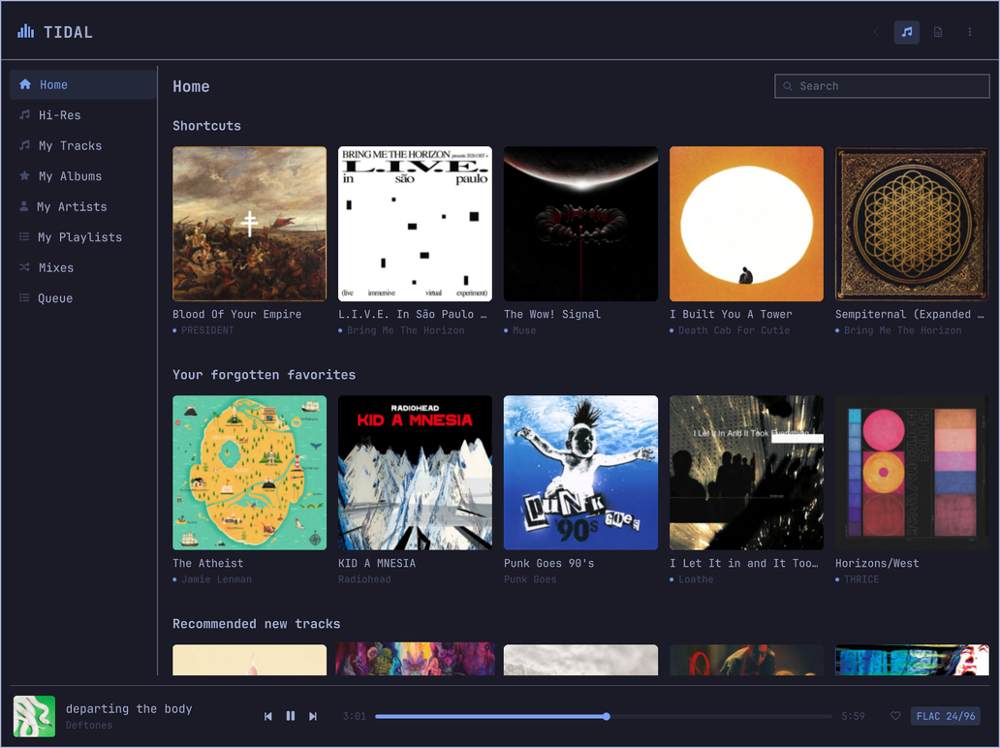
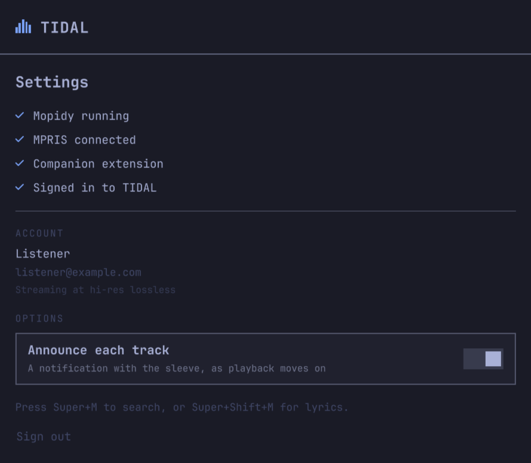
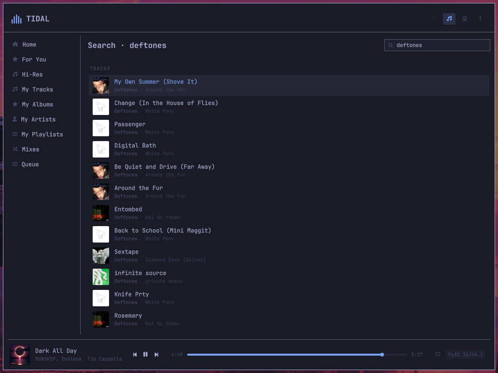
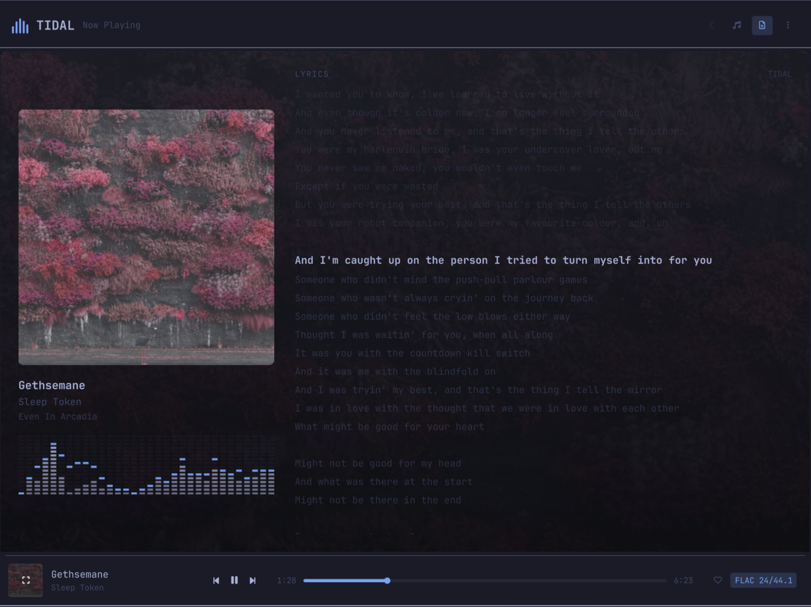
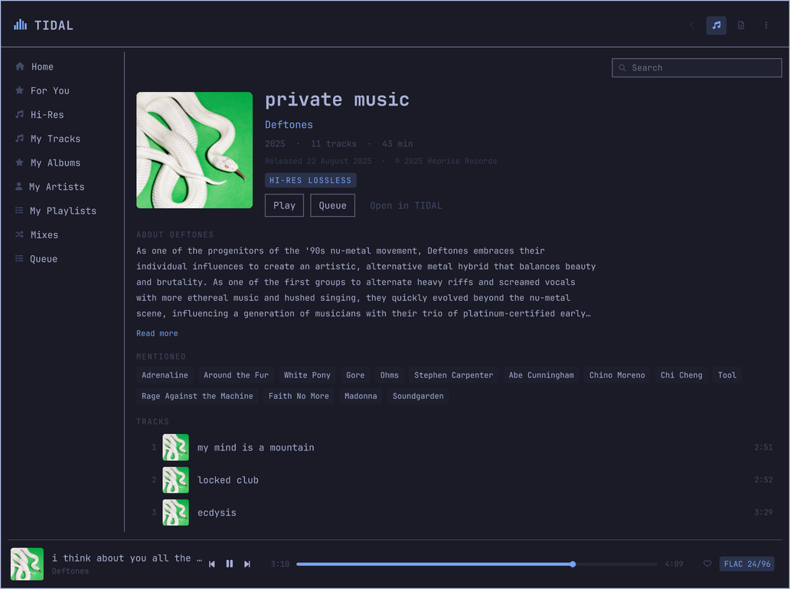
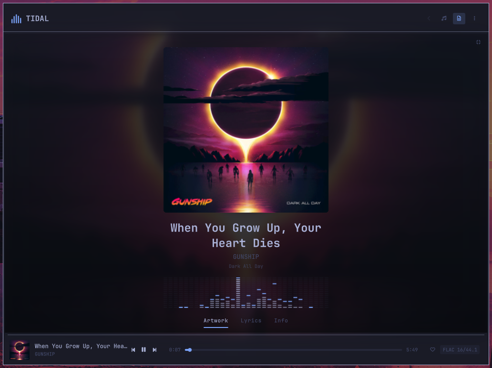
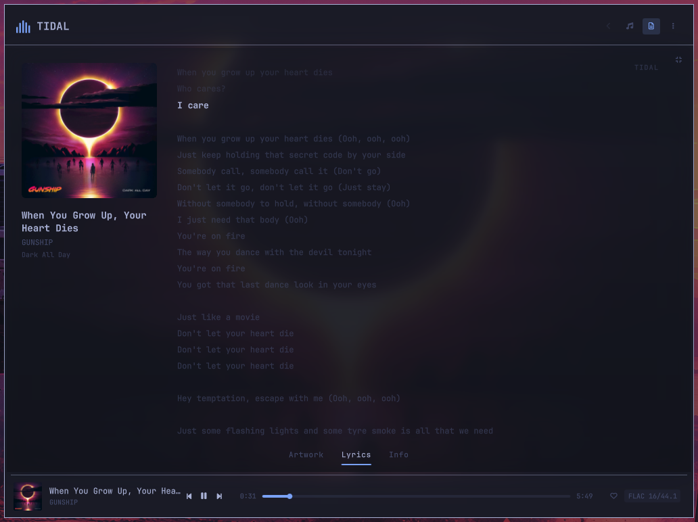
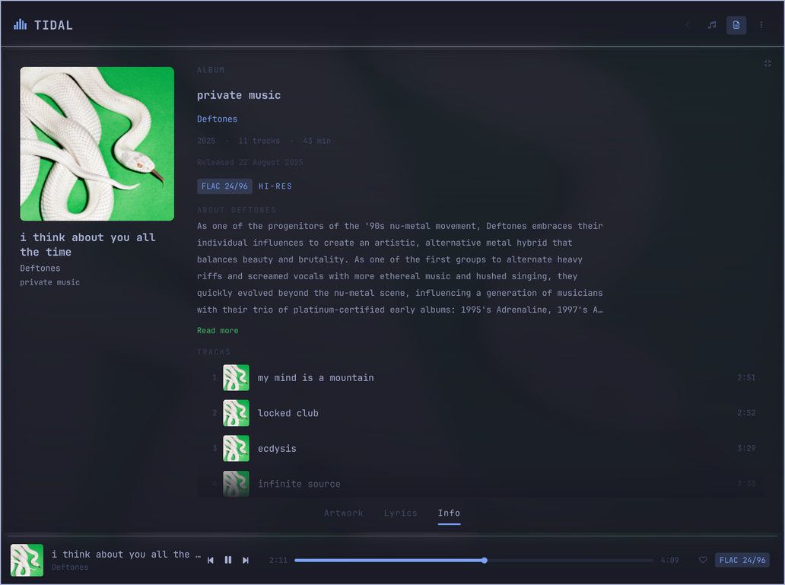
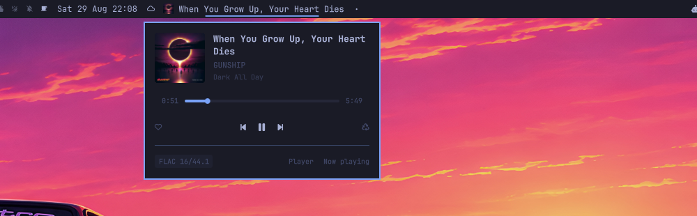

# TIDAL for Omarchy

**True hi-res lossless TIDAL, native to the Omarchy desktop.** 24-bit/192kHz
FLAC, a personalised home page, artist and album pages, time-synced lyrics, a
mini player in the bar and a live spectrum analyser — with no TIDAL window
anywhere.



---

## Requirements

> **A paid TIDAL subscription is required.** This is a client, not a source of
> music: it plays your own TIDAL account through TIDAL's own API. Hi-res needs a
> plan that includes it — on a plan without, everything works and streams come
> back at a lower tier, which the quality badge will tell you plainly.

- **Omarchy 4+** with Quickshell
- **Mopidy 4** from `aur/mopidy4` — *not* `extra/mopidy` (see Known constraints)
- **PipeWire**, for anything above 48 kHz to survive the trip to your DAC
- `tidalapi` is unofficial and TIDAL can change its API without warning. That is
  true of every TIDAL client on Linux.

## Why this exists

Every other way of playing TIDAL on Linux gives something up:

| | Problem |
|---|---|
| `tidal-hifi` (Electron + Widevine) | Plays through a browser engine — **capped at 16-bit/44.1** |
| Native clients (`sone`, `high-tide`) | Reach 24/192, but each owns its own window and its own UI |
| Spotify plugins | `spotifyd` is **capped at 320 kbps Ogg**. No UI work changes that |

This takes a third path: a **headless** backend with the entire interface built
into the Omarchy shell. Now-playing lives in the bar. Search is `SUPER+M`. Media
keys, the OSD and the volume panel behave exactly as they do for everything
else, and every surface follows your active theme — including the washes over
album art, which are drawn from the theme's own colours rather than from black,
so the light themes look deliberate too.

It is also the only TIDAL plugin in a catalogue of 1,700+.

## Install

```bash
omarchy plugin add https://github.com/ph0bos/omarchy-tidal.git
omarchy plugin enable quickshell.tidal
```

Then give it some keys. Omarchy does not bind a plugin's surfaces for you, so
add these to `~/.config/hypr/bindings.lua`:

```lua
-- Omarchy TIDAL
o.bind("SUPER + M",         "TIDAL",          "omarchy-shell tidal overlay")
o.bind("SUPER + SHIFT + M", "TIDAL lyrics",   "omarchy-shell tidal lyrics")
o.bind("SUPER + ALT + M",   "TIDAL favorite", "omarchy-shell tidal favorite")
o.bind("SUPER + CTRL + M",  "TIDAL radio",    "omarchy-shell tidal radio")
```

Then press `SUPER+M`. The plugin detects what is missing and walks you through
installing the backend and signing in — no terminal required. Each check tells
you what to run if it cannot fix itself.

Setup also puts **TIDAL in Omarchy's Apps**, so it opens from the launcher like
anything else — with *Now Playing* and *Settings* on its right-click menu. If
you only want that part:

```bash
./bin/omarchy-tidal-setup desktop
```

Prefer to do it yourself:

```bash
./bin/omarchy-tidal-setup all
```

It asks before replacing any file it did not write — `mopidy.conf` and the
PipeWire drop-in — and keeps a backup of what was there. `--force` answers yes
in advance, for anyone scripting it. `uninstall` takes the launcher entry and
its icon back out again.

## Settings



Open it with `omarchy-shell tidal settings`, or press `SUPER+M` for the player,
then `M` for the quick menu, then choose **Settings**. Bind it to a key if you
want one:

```lua
-- ~/.config/hypr/bindings.lua
o.bind("SUPER + ALT + S", "TIDAL settings", "omarchy-shell tidal settings")
```

It shows the four things that have to be true before music comes out — Mopidy
running, MPRIS connected, the companion extension answering, signed in to TIDAL
— so a silent plugin says which of them is missing rather than nothing at all.
Under those, which account is signed in and at what tier, and the way back out
again: signing out removes the saved session and restarts Mopidy, so it means
what it says.

*(The account above is a placeholder. The real one shows your TIDAL name and
email, which is why this screenshot was taken against stand-in values rather
than redacted afterwards — nothing personal was ever written to the file.)*

**Quit** sits beside *Sign out*, and is also in the quick menu (`M`) and on
`omarchy-shell tidal quit`. It stops playback, empties the queue and closes
every surface — which takes the bar widget with it, since it has nothing left
to display. `SUPER+M`, the Apps entry or the widget bring it all back.

It deliberately does not disable the plugin: that needs a shell restart and
cannot be undone from a surface that no longer exists. If you want it gone
until you say otherwise:

```bash
omarchy plugin disable quickshell.tidal   # takes the widget off the bar
systemctl --user stop mopidy              # and stops the backend
```

Before it is set up, the same surface is the sign-in wizard.

The plugin's own options are kept in `~/.config/omarchy-tidal/settings.json`,
beside the shell's config rather than inside the bar widget's entry, which would
vanish with the widget.

### Track notifications


**Announce each track** puts the record on screen as playback moves on — sleeve,
title, and artist · album — using your desktop's own notification daemon, so it
looks like everything else that talks to you. Each one replaces the previous
rather than stacking a card per song, and they expire after five seconds.

It is on by default. Turn it off in Settings, or from a key:

```bash
omarchy-shell tidal notifications   # toggle announcing on track change
omarchy-shell tidal announce        # announce what is playing, once
```

`announce` is the one to bind if you would rather ask than be told: it puts the
current track on screen on demand, whether or not announcing is on.

## Removing it

```bash
omarchy-tidal-setup uninstall            # companion extension, service, art cache
omarchy plugin remove quickshell.tidal   # the plugin itself
```

`uninstall` stops and removes the Mopidy user unit — but only if this script
wrote it; a packaged one is left to your package manager. Your `mopidy.conf` and
your saved TIDAL session stay put unless you add `--purge`, and packages
installed by `deps` are never touched, since something else on the machine may
be using them.

## Signing in

TIDAL's PKCE flow redirects to `https://tidal.com/android/login/auth` — a remote
URL, so nothing local can catch the callback. That is why every Linux TIDAL
client ends up asking you to paste the address into a form.

This watches your clipboard instead. Sign in, press `Ctrl+L` `Ctrl+C`, and it
completes on its own. If your clipboard manager gets in the way, or `wl-paste`
is not installed, the wizard says so and gives you a field to paste into. The
sign-in link is on screen and copyable throughout, in case the browser never
opened.

## What you get

### Home

The shelves TIDAL's own client opens on — shortcuts, forgotten favourites,
recommendations, recently played — with artwork, straight from your account. Not
a folder list.

There is no separate "For You": TIDAL returns it as the same page. Measured
against a real account, `for_you` and `home` give twenty rows each of which
seventeen are identical — same titles, same items, same order — and the other
three differ only in which record a "Because you listened to" shelf was seeded
from. Home used to ask for both and show itself twice below the fold.

Cards open the album or artist behind them; the play button on a card starts it
without leaving the page.

### Player



Sidebar over the TIDAL tree — Home, your tracks, albums, artists, playlists and
mixes — with search, drill-down, and a queue.

Every row carries its artwork, its artist and its album, and its running time,
the way Apple Music and TIDAL's own client do. Library rows that arrive with
nothing but a name have the rest filled in behind them, and the playing row is
marked on its sleeve.

**My Albums and My Artists open on a wall of covers**, not a list — a record is
recognised by its sleeve long before its title is read, and a list gave each one
a 34px thumbnail and two thirds of a row of nothing. The arrows walk the grid,
`Enter` opens a card and `Shift+Enter` starts it, exactly as on Home. Tracks and
playlists stay lists: a track list is read down a column of titles, and a
playlist row carries its owner and its length.

**Search answers while you type**, a third of a second after you stop — one
request for a word, not one per letter — and answers with people first: artists,
then records, then songs. Searching for a band used to bury the band under a
dozen of their own tracks. `Enter` commits and hands the keyboard to the
results, so the next arrow key moves through them.

### Artist and album pages




Photography, biography, editorial reviews, credits, top tracks, discography and
similar artists. TIDAL's inline markup is cleaned up and the artists it
references become chips you can jump to.

Album pages number their tracks and give each one its running time, name the
artist as a link back to their page, and print the release date and the
copyright line in the small type they belong in. An album with no editorial
review borrows the artist's biography instead of showing an empty page.

### Now playing



The record, centred, and nothing else until you ask for it. A live spectrum
analyser reads PipeWire's own output, so it stays in time with what you hear.

Click the artwork — or press `L` — and it shrinks aside for the lyrics:



Time-synced, and the sheet glides rather than cutting — the line being sung is
larger, brighter and unmistakable among the rest, and clicking any line seeks to
it. A long instrumental is marked with dots that fill as it runs down, so a solo
reads as the song still playing rather than as a sheet that has stuck; the intro
before the first line is marked the same way.



`I` gives you the record instead: the album, its artist, the year, the running
time, the exact release date and the label off the back of the sleeve, what is
actually coming out of the speakers — and the album's own track list, in order,
with the playing track lit and any of them a click from playing. TIDAL writes an
editorial review for maybe one release in five; when there is none, the artist's
biography takes its place rather than leaving the panel with nothing to say.

The sleeve leans toward the pointer, and the light comes with it: a pool of
highlight under the cursor, the far side falling into shadow, both drawn as real
gradients so the shading has no banding and the rounded corners no stair-step.
Small angles and a slow return, because the flourish is the record behaving like
an object rather than the panel showing off — and it belongs to the one sleeve
you are listening to. Shelf tiles and library rows stay perfectly still.

**The view reads the sleeve.** The companion measures each cover — how light it
is, and what colour it is — and the view uses both. A white cover used to lift
the blurred backdrop until the artist and album lines measured 1.15:1 against
it, well under the 4.5:1 that text needs; the wash and the dimming now yield to
the artwork, which puts those lines at 7.1:1 and 6.4:1 on the same cover. The
spectrum analyser and the mini player's playhead take the record's own colour,
lightened only as far as it takes to clear 3:1 — and a black-and-white sleeve
reports no colour at all, so the theme's accent stands rather than tinting the
interface grey.

### Playlists

Press `P` on any track — in search results, in a library list, in the queue — and
a picker asks which of your playlists it belongs in, with **New playlist** at the
top for the ones that do not exist yet. The quick menu has the same entry for
whatever is playing.

Only playlists you made yourself are offered: the favourites list includes other
people's, and adding to those fails at TIDAL's end rather than here.

Playlists open as pages of their own — cover, who made it, how long it runs, and
its tracks — and on one of yours, a row can be taken back out or carried up and
down by the grip on its left. The row moves under your hand and the request
follows; if TIDAL refuses it, the row goes back where it came from and says so.

### Mini player



Click the bar widget and the controls come to you: artwork, a playhead you can
scrub, transport, favourite, radio and the stream's real format. Skipping a
track should not dim the desktop.

**Where to put the widget.** Two placements, for two different jobs, and the
plugin supports both:

- **Centre, with the title** — a now-playing display, which is the default. This
  is where the bar keeps its variable-width widgets (the clock, the weather), so
  a title that changes length with the track belongs here rather than shoving
  the status icons around every few minutes.
- **Right, with the title off** — a control, sitting with audio, network and
  bluetooth, which open their panels the same way the mini player opens under
  this. Turn off **Show track title** and the widget becomes the plugin's mark
  at icon size: monochrome, in the theme's colour, holding still among the other
  status glyphs. An album sleeve at 15 pixels is a coloured smudge rather than
  recognisable artwork, so compact mode shows the mark instead.

In compact mode the widget also stays put when nothing is playing. A display
with nothing to display should get out of the bar; a control you cannot use to
start any music should not.

**Hide when paused** decides which of those you get. Off by default: the widget
leaves the bar only when playback has stopped, so pausing keeps the controls
where you left them. Turn it on and the bar is yours again the moment the music
stops. Either way it is back the next time something plays.

(This used to be less of a choice than it looked. "Nothing to display" meant no
track loaded at all — and Mopidy keeps the last one loaded after a pause, so the
widget sat in the bar all day and only left if you emptied the queue.)

### Sleep timer

In the quick menu, cycling 15, 30, 45, 60 minutes and then "end of track" — the
two things people mean by stop soon. It pauses through MPRIS, so the bar, the
media keys and the OSD all agree about what happened.

Its neighbour in that menu used to say "Pause after track" while toggling
Mopidy's `consume`, which removes each track from the queue once it has played.
It now says that instead.

### Hi-res, verified

The quality badge reports the format TIDAL **actually negotiated** — not the tier
that was requested. `omarchy-tidal-setup audio` also configures PipeWire to
follow the source sample rate, because the default (`allowed-rates = [48000]`)
silently resamples every hi-res stream before it reaches your DAC.

## Keys

| Key | Action |
|---|---|
| `SUPER + M` | Player |
| `SUPER + SHIFT + M` | Now playing and lyrics |
| `SUPER + ALT + M` | Favourite current track |
| `SUPER + CTRL + M` | Start radio from current track |
| `?` (in the player) | Every shortcut, grouped by where it works |

Those four are the ones [Install](#install) suggests; Omarchy binds nothing for
a plugin on its own. Every other surface has an IPC route too, so bind what you
use — same file, same shape:

```lua
-- ~/.config/hypr/bindings.lua
o.bind("SUPER + ALT + S", "TIDAL settings",   "omarchy-shell tidal settings")
o.bind("SUPER + ALT + N", "TIDAL announce",   "omarchy-shell tidal announce")
o.bind("SUPER + ALT + I", "TIDAL the record", "omarchy-shell tidal info")
```

`omarchy menu keybindings --print` lists everything currently bound, so you can
check a combination is free before taking it.

Inside the player: `/` search · `↑`/`↓` move · `Enter` play · `Shift+Enter`
queue · `→` open · `←`/`Backspace` back · `Tab` switch pane · `Space`
play/pause · `Esc` close.

In the queue, `Enter` jumps to that track rather than starting a new queue from
it, `Ctrl`+`↑`/`↓` carries a row up or down the running order, `Delete` takes it
out, and **Clear** in the header empties the lot. `P` on any track asks which
playlist to file it in, `M` opens the quick menu, and **`?` shows the whole map**
— grouped by where each key works, because the arrows mean different things in a
list, on the Home grid and in the queue.

On Home the arrows walk the artwork grid — up and down between shelves, left and
right along one — and `Enter` opens a card while `Shift+Enter` starts it, which
is what the two halves of the card do to the mouse.

In now playing: `A` artwork · `L` lyrics · `I` the record · `Space` play/pause.

Media keys need no configuration — they already drive MPRIS.

Bar widget: **left click opens the mini player**, right click jumps to now
playing, middle click plays/pauses, scroll changes track.

Every surface has an IPC route, so anything here can be bound to a key:

```bash
omarchy-shell tidal overlay      # the player
omarchy-shell tidal nowPlaying   # now playing, on the artwork
omarchy-shell tidal lyrics       # now playing, on the lyrics
omarchy-shell tidal info         # now playing, on the record
omarchy-shell tidal mini         # the bar's mini player
omarchy-shell tidal favorite | radio | shuffle | repeat | consume
omarchy-shell tidal sleep         # cycle the sleep timer
omarchy-shell tidal sleepOff      # cancel it
omarchy-shell tidal settings      # settings, or the sign-in wizard
omarchy-shell tidal notifications # announce each track, or stop
omarchy-shell tidal announce      # announce this one now
omarchy-shell tidal quit          # stop, empty the queue, close everything
omarchy-shell tidal playPause | next | previous
```

## How it works

```
┌──────────────────────────────────────────────────────────┐
│  quickshell.tidal — Quickshell plugin                    │
│  Service · BarWidget + mini player · Player · Now Playing │
└───────┬─────────────────────────────────┬────────────────┘
        │ MPRIS over D-Bus (push state)   │ HTTP JSON-RPC (commands)
┌───────▼─────────────────────────────────▼────────────────┐
│  Mopidy (systemd --user)                                  │
│   ├─ mopidy-tidal    auth · search · library · streaming  │
│   ├─ mopidy-mpris    D-Bus MPRIS2 surface                 │
│   └─ mopidy-omarchy-tidal  lyrics · pages · art · format  │
└──────────────────────────────────────────────────────────┘
              GStreamer → PipeWire → your DAC
```

Playback state arrives over **MPRIS**, which is push-based and free. Commands go
out over Mopidy's HTTP JSON-RPC using QML's built-in `XMLHttpRequest` — no
WebSocket dependency, because Quickshell ships no WebSocket module.

Anything Mopidy's core API has no concept of — lyrics, TIDAL's home page, radio,
favourites, artist and album pages, cover art for a browse ref, the negotiated
stream format — comes from a small companion Mopidy extension that reuses
`mopidy-tidal`'s authenticated session rather than logging in twice.

**Artwork is fetched once.** Mopidy can only answer `get_images()` for tracks,
and only in one of its two URI shapes, so a library view had nothing to draw.
The companion resolves art for any URI and caches it twice over: the address in
memory, the bytes under `~/.cache/omarchy-tidal/art`, pruned by least-recently-used
past 256 MB. Every image in the plugin goes through it, so it survives a shell
restart — which empties Qt's own pixmap cache — and never crosses the network
twice.

## Known constraints

**Your output device has the final say on sample rate.** Many displays advertise
only `44100 48000 96000 192000` over HDMI or DisplayPort and reject the 44.1 kHz
family, so 88.2 kHz albums are resampled to 96 kHz regardless of configuration:

```bash
cat /proc/asound/card*/eld#* | grep sad0_rates
```

A USB or S/PDIF DAC generally accepts the full set.

**Mopidy must come from `aur/mopidy4`, not `extra/mopidy`.** The repo package is
`4.0.0a2`, a pre-release, and `mopidy-mpris` requires `mopidy>=4.0.0`. On the
alpha it fails to import and MPRIS never registers — which breaks the bar
widget, the media keys and the OSD. The setup script handles this.

**Memory**, measured rather than estimated: the Mopidy backend sits at about
150 MB resident with the companion extension in-process. The interface itself
adds roughly 70 MB to the Quickshell process once every surface has been
visited, and settles near 50 MB a minute after you close it and the artwork
cache ages out.

The backend is the larger half and it is the price of lossless — more than a
Rust daemon like `spotifyd` uses, far less than an Electron client, and it only
comes down by replacing Mopidy, which is a different project.

## Development

Code hot-reloads on save under `~/.config/omarchy/plugins/`. Force a reload with
`omarchy-shell shell rescanPlugins`.

**If you develop through a symlink**, the file watcher does not follow it into
your repo — edits appear to do nothing and the shell keeps serving the QML it
loaded first. `rescanPlugins` does not help either. Use `omarchy restart shell`.

```bash
python3 -m pytest tests -q            # companion extension
node --test tests/js.test.mjs         # the QML JavaScript libraries
python3 scripts/validate-manifest.py .
python3 scripts/check-textformat.py . # no Text may default to AutoText
python3 scripts/check-async-guards.py .
python3 scripts/check-js-imports.py . # qmllint cannot see a missing JS import
omarchy plugin validate .

mkdir -p /tmp/qsimports && ln -sfn /usr/share/omarchy/shell /tmp/qsimports/qs
/usr/lib/qt6/bin/qmllint -I /usr/lib/qt6/qml -I /tmp/qsimports qml/**/*.qml
```

The marketplace's own submission rules run in CI too, at a pinned commit, so a
listing problem shows up on a branch rather than in a review comment days later:

```bash
curl -sSfL https://codeload.github.com/HANCORE-linux/omarchy-plugin-marketplace/tar.gz/$(
  python3 -c "import json;print(json.load(open('scripts/marketplace-baseline.json'))['commit'])"
) | tar -xz -C /tmp --strip-components=1 --wildcards '*/scripts/*.mjs'
node scripts/marketplace-baseline.mjs /tmp/scripts .
```

It reports findings (which block a listing), capabilities (which a maintainer
accepts — this plugin installs packages and manages a user service on purpose),
and the listing prerequisites: README, licence, and a root `preview.png`.

`Member ... not found on type "QObject"` warnings are expected — the injected
`bar` and the `Style`/`Color` singletons are untyped. Omarchy's own widgets
produce the same warnings.

Write Nerd Font glyphs as `\uXXXX` escapes. Shell heredocs silently strip
private-use codepoints, which shows up as invisible icons rather than as an
error. CI checks for it.

## Diagnostics

```bash
omarchy-tidal-setup check     # every dependency, config and service
omarchy-shell tidal status    # live playback state as JSON
```

## Licence

MIT. Not affiliated with or endorsed by TIDAL.
